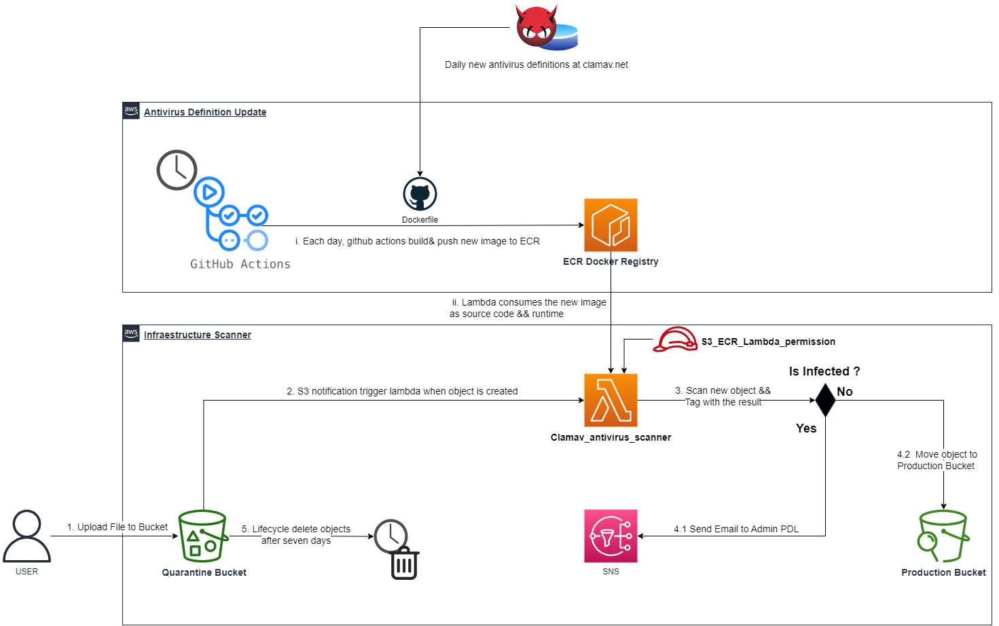

# S3 Quarantine Bucket Architecture

This architecture provides a way to scan files uploaded by users to an S3 bucket of quarantine, and move clean files to a production bucket. The architecture uses a Lambda function written in Node.js and the clamav engine to scan files for viruses.

## Architecture Overview

1. A user uploads a file to the S3 bucket of quarantine.
2. S3 triggers a notification, which in turn triggers a Lambda function.
3. The Lambda function downloads the file and scans it using the clamav engine.
4. If the file is infected, the Lambda function sends an email using an SNS topic to notify an administrator that the file is infected and needs to be dealt with.
5. If the file is clean, the Lambda function moves the file to the production bucket for use in the production environment.

## Build Process

There is also a scheduled process that runs each midnight, which uses GitHub actions to build, tag, and push an image to an ECR private repository. This image is used as the environment and code for the Lambda function.

The Dockerfile used to build the image starts from public.ecr.aws/lambda/nodejs:16 and installs the clamav tool. It then updates the virus database definition and uses a JavaScript file as a handler for the Lambda function.

## Installation and Usage

To install and use this architecture, you will need to:

1. Create an S3 bucket of quarantine.
2. Create an SNS topic and subscribe an email address to it.
3. Create an IAM role for the Lambda function with permissions to access the S3 buckets and the SNS topic.
4. Deploy the Lambda function using the image built and pushed to the ECR private repository.
5. Configure the S3 bucket of quarantine to trigger the Lambda function when a file is uploaded.

## License

This architecture is released under the MIT License. See `LICENSE` for more information.

